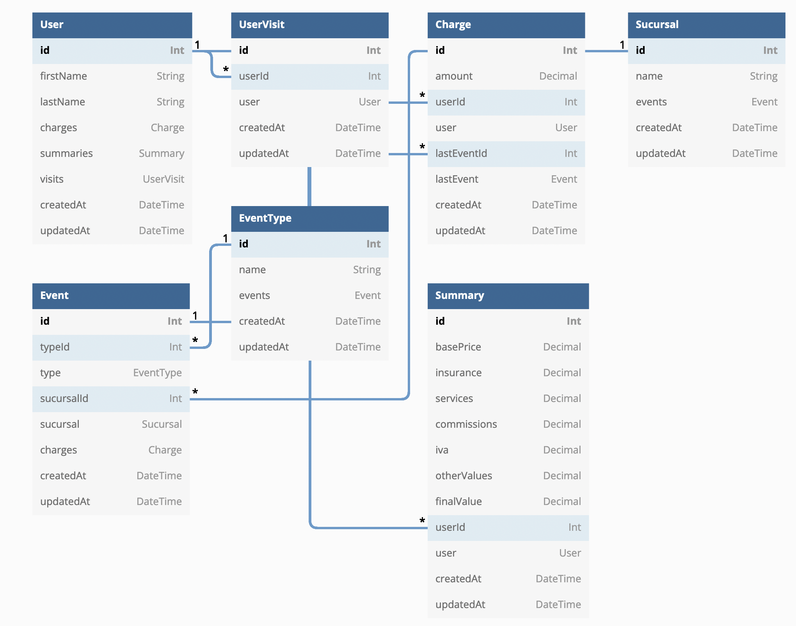

# Shippify's backend challenge solution

This project uses Nodejs + Express + Prisma. The endpoints of this web api are the following (all with GET, POST, PUT, DELETE operations):

- `/api/v1/users` | Available methods: `GET, POST, PUT, DELETE`
- `/api/v1/user-visits` | Available methods: `GET, POST, PUT, DELETE`
- `/api/v1/charges` | Available methods: `GET, POST, PUT, DELETE`
- `/api/v1/sucursals` | Available methods: `GET, POST, PUT, DELETE`
- `/api/v1/events` | Available methods: `GET, POST, PUT, DELETE`
- `/api/v1/client-summary` | Available methods: `POST`

This is the ER Diagram of the database.



## Steps

---

**DISCLAIMER:** You _must_ have an instance of MySQL for this project to run. However, if you have `docker` you could compose the services defined in `docker-compose.yml`. By default, it executes the command `npm run dev`.

First, you need to create an `.env` file at the root of the project. You could use the example in the `.env.sample` file.

Then, do a `npm install`.

Once you did that, you could execute any script defined in `package.json`.

## Commands

---

```
npm run dev # start the app in development mode
npm run build # build app for production
npm run start # start production build
```
